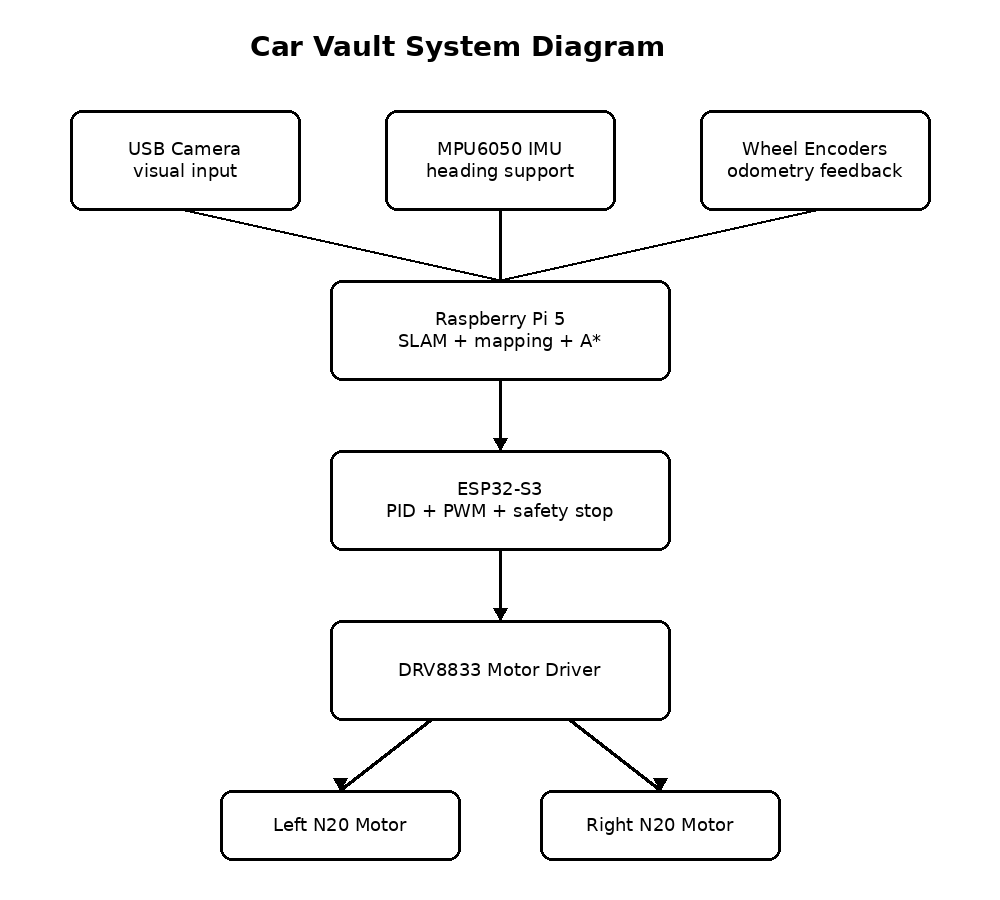
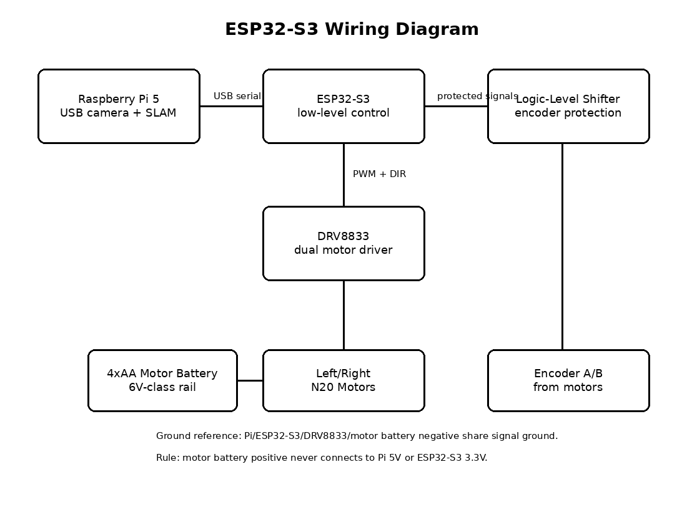
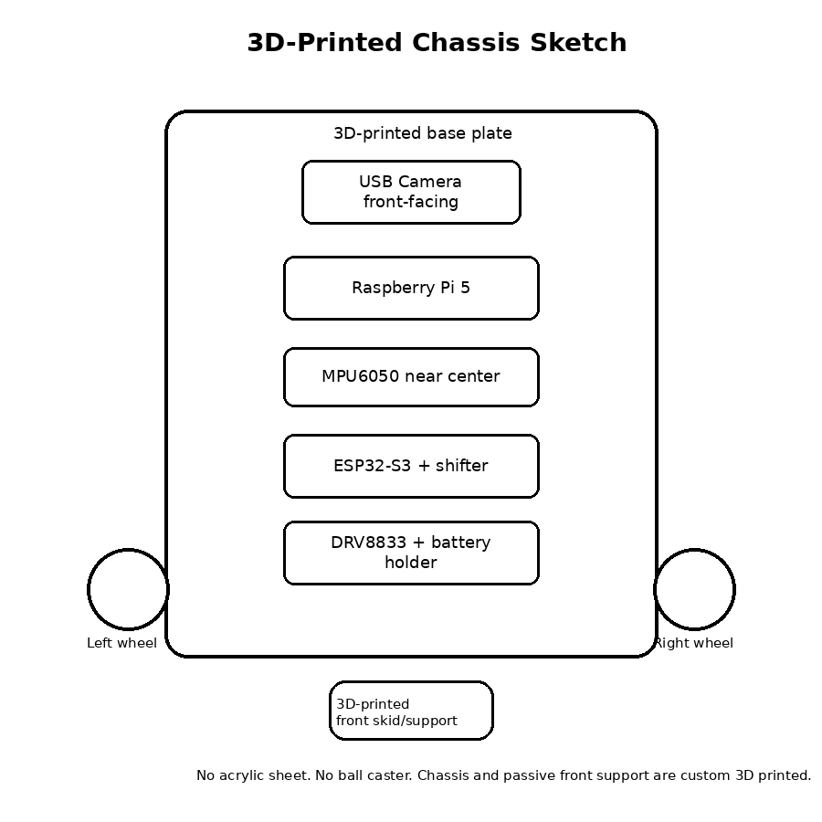

# SLAM Car

SLAM Car is a small indoor robot I want to work on. I want it to drive around inside, make a basic map, and move to a target point without me controlling it the whole time. I want it to act just like Tesla autopilot, so this car is only vision based :) . 

It uses a Raspberry Pi 5, ESP32-S3, USB camera, MPU6050 IMU, and two N20 motors with encoders.




These are all the parts needed:


## Project Summary

I am trying to build something closer to a real robot, but still small enough for me to actually make and test.

The Raspberry Pi 5 does the bigger jobs. It handles the camera, SLAM testing, mapping, path planning, and deciding where the robot should go.

The ESP32-S3 does the motor jobs. It reads the wheel encoders, controls the motors, runs PID, stops the motors if something goes wrong, and sends data back to the Pi.

This is what happens:

```text
Camera + IMU + Wheel Encoders
          |
          v
    Position Estimate
          |
          v
         Map
          |
          v
     A* Path
          |
          v
    PID Control
          |
          v
       Motors
```

## Why I Am Building This

I am building this because I want to learn how autonomous robots and vehicles actually work. A lot of  robot cars only drive with a remote or avoid obstacles with one sensor. I wanted to try something harder and something that challenges me by making me reach into a field that I dont really have too much experience in. 

This project helps me learn:

- How a robot uses a camera to understand a room
- How an IMU helps with turning and direction
- How wheel encoders measure movement
- How a robot can make a map
- How A* can plan a path
- How PID helps motors move more evenly
- Why the Pi power and motor power should stay separate
- How to protect 3.3V GPIO pins
- How to design and print chassis parts

## What I Want The Robot To Do

the final robot should be able to:

1. Drive indoors with two powered N20 motors.
2. Read wheel encoder data.
3. Read IMU data for turning and heading.
4. Use a USB camera with the Raspberry Pi 5.
5. Estimate where it is as `(x, y, theta)`.
6. Make a simple indoor map.
7. Plan a path to a goal using A*.
8. Drive toward the goal using PID.
9. Stop if the sensors or motor commands become unsafe.

## Hardware Plan

### Raspberry Pi 5

The Raspberry Pi 5 will handle:

- USB camera input
- SLAM tests
- Mapping
- A* path planning
- High-level movement decisions
- Future YOLO object detection with the Raspberry Pi AI HAT+ 26 TOPS / Hailo-8

### ESP32-S3

The ESP32-S3 will handle:

- Left and right encoder reading
- Motor PWM
- Motor direction
- Wheel-speed PID
- Safety stop behavior
- Debug/telemetry output
- USB serial communication with the Raspberry Pi 5

### Sensors

The robot uses:

- USB camera for vision
- MPU6050 IMU for gyro/orientation data
- Wheel encoders for wheel movement feedback

### Drivetrain

The robot drives like a small differential-drive robot:

- Two powered 6V N20 encoder motors
- Two D-hole rubber wheels
- One 3D-printed front skid/support
- DRV8833 motor driver
- Separate motor power rail

## Power And Wiring Safety

The Pi and the motors should not run from the same power line.

- Raspberry Pi 5 gets stable 5V USB-C power.
- Motors get separate 6V-class battery power.
- ESP32-S3 is powered from USB or a regulated 5V input.
- Motor battery positive should never connect to Raspberry Pi 5V or ESP32-S3 3.3V.
- Grounds need to be connected correctly when signals go between boards.

The ESP32-S3 uses 3.3V GPIO. If the encoder signals are 5V, I need a logic-level shifter so I do not damage the board.



## 3D-Printed Parts

I am making the base and front support with 3D printing because I have a 3d printer at home with enough filament. 

Included CAD files:

- `cad/chassis_base.stl` - first base plate model
- `cad/front_skid.stl` - front skid/support model

I probably have to make this better, but because I dont have exact dimensions for the parts, it's hard for me to judge. 



## Software Plan

The software will be split into simple parts:

```text
camera/
  Gets camera frames.

sensors/
  Reads IMU and encoder data.

slam/
  Helps estimate where the robot is.

mapping/
  Builds the map.

planning/
  Runs A* path planning.

control/
  Turns the path into movement commands.

firmware/
  Runs the motor control on the ESP32-S3.
```

## Build Plan

### Phase 1: Get The Hardware Working

- 3D print the chassis and front skid
- Mount the motors
- Mount the camera
- Wire the DRV8833 motor driver
- Wire the encoders safely
- Check the separate power rails
- Test the motors slowly
- Test the encoders
- Test the MPU6050
- Test the USB camera
- Write down real measurements

### Phase 2: Measure And Calibrate

- Measure wheel diameter
- Measure wheelbase
- Record encoder ticks per revolution
- Calculate centimeters per encoder tick
- Calibrate IMU gyro bias
- Record camera resolution, FPS, height, and tilt

### Phase 3: Motor Control

- Add motor mixing
- Add wheel-speed PID
- Test driving straight
- Test 90-degree turns
- Add speed limits and safety stop rules

### Phase 4: Mapping And Planning

- Run camera SLAM tests
- Estimate robot position
- Build a basic map
- Run A* on the map
- Output waypoints

### Phase 5: Final Demo

- Pick a simple indoor goal
- Build or load a small map
- Plan a path
- Drive toward the goal
- Stop safely if something fails

## What I Need Funding For

I already have some major parts, and I can 3D print the chassis myself. I need funding for the parts that make the robot actually drive and stay safe.

Funding will help buy:

- N20 6V encoder motors
- DRV8833 motor driver
- ESP32-S3 development board
- Logic-level shifter
- Motor brackets
- Motor battery holder and AA cells
- Standoffs and screws
- D-hole N20 wheels
- Raspberry Pi 5 mobile UPS/battery parts

These parts could also be recycled for other projects i make!

Estimated requested funding subtotal in `BOM.csv`: **$151.59**.

## Sorry for making you read so much!
